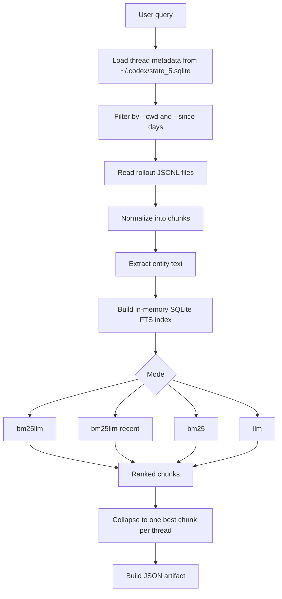
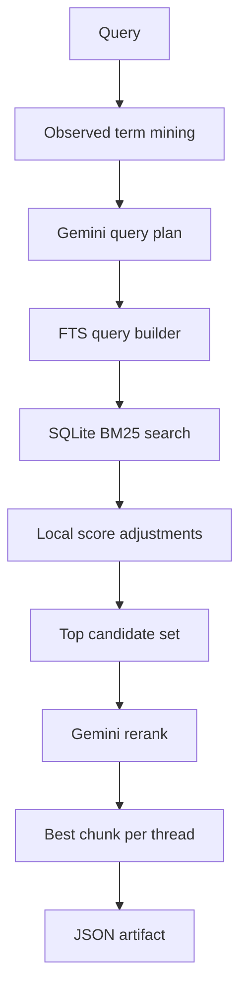
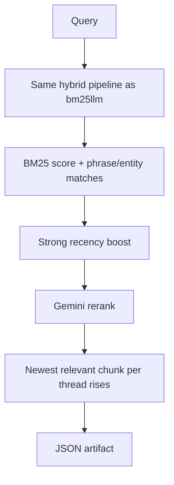
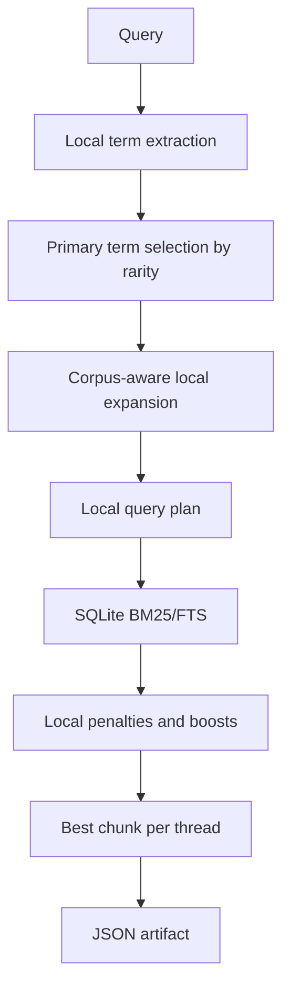
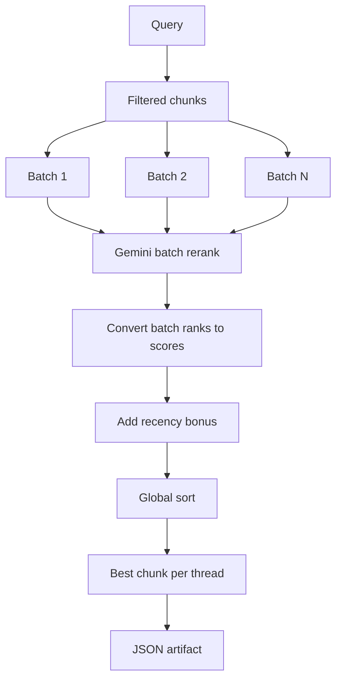

# ask-codex-sessions

Local CLI for searching prior Codex CLI sessions stored under `~/.codex`.

It is designed for questions like:

- "What was the latest spec for the orchestration interface?"
- "Find earlier discussions about making the interface simpler."
- "Show me the exact session and quote where we chose Rust."

The tool reads thread metadata from `~/.codex/state_5.sqlite`, then follows the rollout paths stored there to the JSONL session files under `~/.codex/sessions/`.

By default, the command prints the JSON result itself to `stdout`.

If you pass `-o, --out-dir <PATH>`, it writes a JSON artifact file into that directory and prints only the file path to `stdout`.

## What It Does

The CLI searches old Codex sessions and returns:

- the Codex session id
- a `codex resume <session_id>` command
- the absolute path to the rollout file
- the chunk id that matched
- source line numbers inside the rollout file
- a quoted snippet
- ranking metadata and scores
- optional summaries
- an optional direct answer to the original query

## Search Modes

The public commands are named after the retrieval strategy they use.

| Command | Meaning | When to use |
| --- | --- | --- |
| `bm25llm` | Gemini query planning + SQLite FTS/BM25 retrieval + Gemini reranking | Best general default |
| `bm25llm-recent` | Same as `bm25llm`, but with a stronger recency bias | Best for "latest spec" or "most recent discussion" |
| `bm25` | Pure local BM25/FTS retrieval, no Gemini calls | Fastest, cheapest baseline |
| `llm` | Gemini reviews filtered chunks directly | Most expensive, most semantic |

The current default Gemini model is:

- `gemini-3-flash-preview`

If you do not specify a mode, the CLI defaults to:

- `bm25llm`
- `--since-days 30`
- `--answer`

Choose a mode like this:

- no Gemini configured yet
  - use `bm25`
- best general search quality
  - use the default invocation or `bm25llm`
- newest relevant discussion or latest spec
  - use `bm25llm-recent`
- most semantic, most expensive scan
  - use `llm`

## Requirements

- Rust toolchain
- local Codex history under `~/.codex`
- Gemini CLI installed and authenticated if you want to use `bm25llm`, `bm25llm-recent`, `llm`, `--sum`, or `-a`

The current code defaults to:

- state DB: `/home/kirill/.codex/state_5.sqlite`
- sessions root: `/home/kirill/.codex/sessions`

## Install

If you do not already have Rust and Cargo:

1. Install Rust with `rustup`:

```bash
curl https://sh.rustup.rs -sSf | sh
```

2. Restart your shell, or load Cargo into the current shell.

For `bash` or `zsh`:

```bash
source "$HOME/.cargo/env"
```

For `fish`:

```fish
source "$HOME/.cargo/env.fish"
```

3. Verify the tools are available:

```bash
rustc --version
cargo --version
```

4. Build and install this project from the repository root:

```bash
cargo install --path .
```

That installs the binary into:

- `~/.cargo/bin/ask-codex-sessions`

If `~/.cargo/bin` is not already on your `PATH`, add it to your shell config.

For `bash` or `zsh`:

```bash
export PATH="$HOME/.cargo/bin:$PATH"
```

For `fish`:

```fish
fish_add_path "$HOME/.cargo/bin"
```

Then restart your shell and verify the binary:

```bash
ask-codex-sessions --help
```

### Install from GitHub

If you want the closest thing to an `npx`-style install-and-use flow, there are two practical options.

Option 1: install directly from GitHub with Cargo:

```bash
cargo install --git https://github.com/kirilligum/ask-codex-sessions.git --locked
```

Then run:

```bash
ask-codex-sessions --help
```

This is not exactly `npx`, but it is the closest built-in Rust workflow:

- Cargo downloads the Git repository once and caches it
- Cargo builds and installs the binary into `~/.cargo/bin`
- later runs use the installed binary directly

Option 2: use the repository installer script:

```bash
bash <(curl -fsSL https://raw.githubusercontent.com/kirilligum/ask-codex-sessions/main/install.sh)
```

That script:

- checks that `cargo` exists
- installs from the GitHub repository with `cargo install --git ... --locked`
- prints the binary path and `PATH` setup reminder

After either install path, normal usage is just:

```bash
ask-codex-sessions bm25llm "firebase orchestration interface"
```

If you already have Rust and only want to build locally without installing:

```bash
cargo build
```

Then run it with:

```bash
cargo run -- --help
```

## Build

```bash
cargo build
```

You can also run everything directly with `cargo run -- ...`.

## Help

Root help:

```bash
ask-codex-sessions --help
```

Per-command help:

```bash
ask-codex-sessions bm25llm --help
ask-codex-sessions bm25llm-recent --help
ask-codex-sessions bm25 --help
ask-codex-sessions llm --help
```

## Quick Start

Fastest smoke test, no Gemini required:

```bash
ask-codex-sessions bm25 "rust sqlite gemini" | jq '.results[0]'
```

Best default, requires Gemini:

```bash
ask-codex-sessions "firebase orchestration interface"
```

Newest relevant discussion or latest spec, requires Gemini:

```bash
ask-codex-sessions bm25llm-recent "what was the latest spec for the interface"
```

Saved artifact plus `jq` workflow:

```bash
file="$(ask-codex-sessions -o ./responses 'firebase orchestration interface')"
jq '.results[0]' "$file"
```

## Common Flags

All search commands support:

- `-d`, `--debug`
  - print the pipeline stages and ranking details to `stderr`
- `-s`, `--sum`
  - add summaries to the JSON output
- `-a`, `--answer`
  - add a direct answer to the original query in the JSON output
- `-C`, `--cwd <PATH>`
  - restrict search to sessions whose recorded `cwd` exactly matches this path
- `-t`, `--since-days <DAYS>`
  - only search sessions newer than the given number of days
- `-l`, `--limit <N>`
  - cap the number of ranked results
- `-o`, `--out-dir <PATH>`
  - write the JSON result into that directory and print only the file path

Long forms still work:

- `--cwd <PATH>`
  - restrict search to sessions whose recorded `cwd` exactly matches this path
- `--since-days <DAYS>`
  - only search sessions newer than the given number of days
- `--limit <N>`
  - cap the number of ranked results
- `--out-dir <PATH>`
  - write the JSON result into that directory and print only the file path
- `--debug`
- `--sum`
- `--answer`

Examples:

```bash
ask-codex-sessions -C /home/kirill/p/ask-codex-sessions -t 90 -l 3 "firebase orchestration interface"
```

```bash
ask-codex-sessions bm25llm-recent -s -a -C /home/kirill/p/ask-codex-sessions -t 90 "what tech stack did we choose for the session search tool"
```

```bash
ask-codex-sessions bm25 -d -C /home/kirill/p/ask-codex-sessions -t 90 "rust sqlite gemini"
```

```bash
ask-codex-sessions -o ./responses -C /home/kirill/p/ask-codex-sessions -t 90 "firebase orchestration interface"
```

## Output

Default behavior:

- print pretty JSON to `stdout`

Example:

```bash
ask-codex-sessions "firebase orchestration interface" | jq '.results[0]'
```

File output behavior with `-o, --out-dir`:

- write a JSON artifact into the given directory
- print only the file path to `stdout`

Example:

```bash
ask-codex-sessions -o ./responses "firebase orchestration interface"
```

Example output:

```bash
./responses/20260307T023647Z-Search-Hybrid-firebase-orchestration-interface.json
```

The JSON contains:

- top-level query metadata
- mode and preset
- optional top-level `summary`
- optional top-level `answer`
- ranked `results`

Each result contains:

- `rank`
- `session_id`
- `thread_id`
  - currently the same value as `session_id`
- `resume_command`
- `session_path`
- `text_id`
- `source_start_line`
- `source_end_line`
- `title`
- `created_at`
- `created_at_iso`
- `quote`
- optional `summary`
- `score`
- `metadata`

Typical `jq` usage:

Show the top hit directly from stdout:

```bash
ask-codex-sessions "firebase orchestration interface" | jq '.results[0]'
```

Show the top hit from a saved artifact path:

```bash
file="$(ask-codex-sessions -o ./responses 'firebase orchestration interface')"
jq '.results[0]' "$file"
```

Show the main fields you usually care about:

```bash
file="$(ask-codex-sessions -o ./responses 'firebase orchestration interface')"
jq '.results[] | {rank, session_id, resume_command, session_path, text_id, quote}' "$file"
```

Show only summaries:

```bash
file="$(ask-codex-sessions -o ./responses -s -a 'firebase orchestration interface')"
jq '{summary, answer, results: [.results[] | {rank, text_id, summary}]}' "$file"
```

Extract the rollout path for direct inspection:

```bash
file="$(ask-codex-sessions -o ./responses 'firebase orchestration interface')"
jq -r '.results[0].session_path' "$file"
```

Resume the top session in Codex:

```bash
file="$(ask-codex-sessions -o ./responses 'firebase orchestration interface')"
codex resume "$(jq -r '.results[0].session_id' "$file")"
```

## How It Works

At a high level:

1. load thread metadata from `~/.codex/state_5.sqlite`
2. filter by `cwd` and time range
3. parse rollout JSONL files into user/assistant chunks
4. extract code-like entities such as paths, commands, and identifiers
5. build an in-memory SQLite FTS index
6. run one of the configured retrieval modes
7. generate a JSON artifact with citations

Overview diagram:



### Shared preprocessing and indexing

Before any mode runs, the tool does the same setup work:

- it loads all threads from the Codex `threads` table
- it filters by:
  - exact `cwd`
  - minimum creation time derived from `--since-days`
- it parses each rollout JSONL file and keeps visible user/assistant messages
- it ignores assistant `commentary` messages and known boilerplate blocks
- it groups messages into chunks:
  - one user message
  - followed by the assistant response block that belongs to that user message
- it records:
  - `thread_id`
  - `chunk_id`
  - rollout line numbers
  - `user_text`
  - `assistant_text`
  - full `dialogue_text`
  - extracted `entity_text`

Entity extraction is intentionally simple and exact-match oriented. It pulls out:

- code-like backticked values
- absolute paths
- technical tokens such as commands, identifiers, filenames, and mixed-case strings

The search index is an in-memory SQLite database with:

- `sessions`
- `chunks`
- `fts_chunks`

`fts_chunks` indexes three fields:

- `user_text`
- `assistant_text`
- `entity_text`

The BM25 weights currently favor assistant and entity text over user text:

- user field weight: `0.0`
- assistant field weight: `1.0`
- entity field weight: `1.3`

That design tries to rank answers and exact technical anchors above restatements of the original question.

### Algorithm: `bm25llm`

`bm25llm` is the main hybrid mode.

Detailed flow:

1. Build the shared filtered chunk set.
2. Mine observed terms from the filtered corpus.
3. Ask Gemini to create a constrained query plan:
   - keywords
   - phrases
   - only using query terms and observed terms
4. Convert that plan into an SQLite FTS query.
5. Run BM25/FTS search.
6. Apply local score adjustments:
   - phrase matches
   - entity matches
   - assistant-side keyword matches
   - small recency boost
   - transcript / structured-dump penalties
7. Keep the top candidate set.
8. Ask Gemini to rerank those candidates.
9. Collapse to one best chunk per thread.
10. Build a cited JSON artifact.

Important implementation details:

- Gemini does not search the whole corpus directly in this mode.
- Gemini is used twice:
  - once to build the query plan
  - once to rerank candidate chunks
- local ranking penalties try to demote:
  - pasted command transcripts
  - JSON dumps
  - chunks that simply echo the search query



### Algorithm: `bm25llm-recent`

`bm25llm-recent` is the same pipeline as `bm25llm`, but it pushes newer sessions upward more aggressively.

The only intended ranking difference is recency weight:

- `bm25llm`: recency bonus is scaled by `0.35`
- `bm25llm-recent`: recency bonus is scaled by `1.5`

Use it when the question is really asking:

- what is the latest version
- what changed most recently
- what was the newest spec



### Algorithm: `bm25`

`bm25` avoids Gemini completely.

Detailed flow:

1. Build the shared filtered chunk set.
2. Extract query terms locally.
3. Choose the most useful primary query terms based on rarity in the filtered corpus.
4. Mine additional local expansion terms from co-occurring assistant/entity text.
5. Build a local query plan:
   - keywords
   - one main phrase when useful
6. Run SQLite FTS/BM25 search.
7. Apply local score adjustments:
   - phrase matches
   - entity matches
   - assistant-side keyword matches
   - small recency boost
   - transcript penalties
   - structured dump penalties
   - query-echo penalties
8. Collapse to one best chunk per thread.
9. Build a cited JSON artifact.

What this mode is good at:

- fast local searching
- exact terms
- commands
- file paths
- identifiers

What it is weaker at:

- paraphrases
- abstract questions
- finding an answer chunk that uses very different wording than the query



### Algorithm: `llm`

`llm` skips SQLite retrieval as the first ranking step and lets Gemini judge chunk batches directly.

Detailed flow:

1. Build the shared filtered chunk set.
2. Create a lightweight local query plan only for snippet/match labeling.
3. Split all filtered chunks into batches.
4. For each batch:
   - send batch candidates to Gemini
   - ask Gemini to order them for the query
5. Turn the batch rank into a local score.
6. Add the same recency bonus logic used by the other modes.
7. Merge all batch-ranked chunks.
8. Sort globally.
9. Collapse to one best chunk per thread.
10. Build a cited JSON artifact.

This mode is more semantic than `bm25`, but slower and more expensive because Gemini sees far more raw chunk text.



### Chunking and result selection

No matter which mode is used, result packaging follows the same rules:

- snippets are taken from the original chunk text, not invented text
- every result includes:
  - session id
  - rollout path
  - chunk id
  - source line numbers
  - quote
- only one top chunk per thread is returned in the final ranked list

That last rule is important. It means if five chunks from the same session are strong matches, the final output still shows that session only once.

### Why the tool uses both BM25 and exact entities

The implementation treats session search as two related problems:

- lexical relevance
  - does this chunk use the same words or phrases as the query?
- exact technical anchoring
  - does this chunk mention the exact path, command, identifier, or symbol the user cares about?

That is why entity extraction is separate from normal dialogue text. A session may be relevant because it contains:

- `state_5.sqlite`
- `gemini-3-flash-preview`
- `/home/kirill/.codex/sessions/...`
- `cargo run --`
- exact config names or identifiers

Those exact strings are often more stable and more useful than broad natural-language similarity.

## Current Behavior and Limitations

- Filtering by repository is currently implemented as exact `cwd` equality, not by Git remote or fuzzy repo matching.
- The search index is rebuilt in memory on each run. There is no persistent incremental index yet.
- `bm25` is useful as a baseline, but it is less reliable than `bm25llm` or `llm` for questions where the answer chunk does not reuse the same wording as the query.
- Hybrid and LLM modes depend on the local `gemini` CLI.
- The tool is local-first and read-only with respect to Codex history.

## Development

Run the full test suite:

```bash
cargo test -- --nocapture
```

Useful targeted tests:

```bash
cargo test test_cli_has_search_and_latest_spec --test cli_contract -- --exact --nocapture
cargo test test_hybrid_search_pipeline_finds_current_session --test search_pipeline -- --exact --nocapture
cargo test test_lexical_mode_finds_current_session_without_gemini_planner --test lexical_mode -- --exact --nocapture
cargo test test_llm_search_mode_finds_current_session_by_chunk_judging --test llm_search_mode -- --exact --nocapture
```

## Repository Layout

- `src/cli.rs`
  - CLI definitions and help text
- `src/main.rs`
  - command dispatch and artifact writing
- `src/source.rs`
  - loads thread metadata from Codex SQLite state
- `src/normalize.rs`
  - parses rollout JSONL files into chunks and entities
- `src/index.rs`
  - in-memory SQLite FTS/BM25 index and ranking
- `src/search.rs`
  - retrieval pipeline
- `src/gemini.rs`
  - Gemini CLI integration
- `src/output.rs`
  - JSON artifact schema and writing
- `tests/`
  - fixture-driven regression tests

## Recommended Starting Point

If you want the quickest local sanity check without Gemini:

```bash
ask-codex-sessions bm25 "rust sqlite gemini" | jq '.results[0]'
```

If you want the best default:

```bash
ask-codex-sessions "your question here"
```

If you want the newest matching discussion rather than the best overall match:

```bash
ask-codex-sessions bm25llm-recent --since-days 90 "your question here"
```

If you specifically care about the newest decision:

```bash
ask-codex-sessions bm25llm-recent --since-days 90 "your question here"
```
