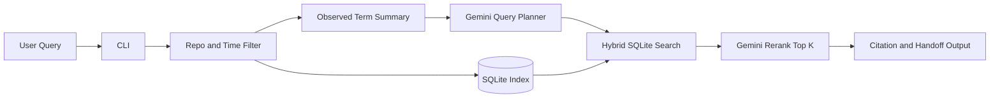

=== document: plans/ask-codex-session-search-plan.md ===
1. Title and Metadata

- Project name: Ask Codex Session Search CLI
- Version: 0.2.0-plan
- Owners: Repository maintainer; implementation owner to be assigned in repo
- Date: 2026-03-06
- Document ID: PLAN-ASKCODEX-2026-03-06-002
- Summary:
  - Build a local-first Rust CLI that searches prior Codex CLI sessions stored on the same workstation and returns cited verbatim evidence for natural-language questions. The repository currently contains no Rust application code, no Cargo project, and no test runner; the implementation will add a small Rust CLI under `src/` and `tests/` while reading source data from `/home/kirill/.codex/state_5.sqlite` and `/home/kirill/.codex/sessions/`. The plan uses one direct retrieval pipeline: filter the local corpus, ask Gemini to build a structured search plan from observed corpus terms, run one SQLite hybrid search over chunk text plus exact entity text, rerank the top candidates with Gemini, and return cited snippets.

2. Design Consensus & Trade-offs

- Topic: Implementation language
  - Verdict: FOR Rust
  - Rationale: The tool is a local CLI with parsing, SQLite, subprocess execution, and test-heavy development; Rust fits this without adding C++ complexity.
- Topic: Retrieval architecture
  - Verdict: FOR one integrated pipeline
  - Rationale: The system should not have separate fast and robust modes, legacy paths, or fallbacks. It should always run the same steps in the same order.
- Topic: LLM usage
  - Verdict: FOR one Gemini planner and one Gemini rerank step
  - Rationale: Gemini is useful for turning a natural-language question into a structured search plan and for checking the top retrieved chunks, but the codebase should not include multiple planners or a second exhaustive retrieval mode.
- Topic: Hybrid retrieval
  - Verdict: FOR SQLite FTS5 plus exact-entity bonuses plus Gemini rerank
  - Rationale: Exact identifiers, paths, and phrases matter in Codex sessions; BM25 alone is not enough, but a compact hybrid score is simpler than multiple retrieval subsystems.
- Topic: Storage
  - Verdict: FOR one small SQLite index
  - Rationale: Keep one local index file with only the data needed for search and citations. Avoid extra telemetry tables, vocab tables, and adapter layers until proven necessary.
- Topic: Data model
  - Verdict: FOR minimal schema
  - Rationale: Store only `sessions`, `chunks`, and one FTS table. Keep entity extraction as chunk-level text instead of a separate graph-like structure.
- Topic: CLI surface
  - Verdict: FOR a minimal command surface
  - Rationale: The first version should expose one default `search` command and one `latest-spec` preset that only changes query biasing, not architecture.
- Topic: Depth and payloads
  - Verdict: FOR dialogue-first v1
  - Rationale: Default retrieval should use user and assistant dialogue plus exact entities derived from visible text. Tool payloads, edits, and reasoning stay out of v1 scope.
- Topic: Testing strategy
  - Verdict: FOR a small but strict gold-test harness
  - Rationale: The current conversation session `019cc49c-0918-7c11-9a8a-630c28b9b443` is a concrete regression target. A small set of deterministic tests is enough for the first version.

3. PRD (IEEE 29148 Stakeholder/System Needs)

- Problem
  - Prior Codex CLI sessions contain design history, interface decisions, exact identifiers, and implementation rationale that are hard to recover manually.
  - The data already exists locally but is split across a SQLite metadata store and rollout JSONL files.
- Users
  - Primary user: a developer using Codex CLI who wants to recover previous design discussions and the latest spec for a topic.
  - Secondary user: an AI assistant running in the same repository that needs reliable local retrieval with citations.
- Value
  - Recover previous decisions quickly.
  - Preserve exact wording, identifiers, and file references.
  - Reduce duplicated design work.
- Business Goals
  - Deliver a useful local CLI with small code size.
  - Keep the architecture single-path and easy to maintain.
  - Ground answers in verbatim evidence.
- Success Metrics
  - Current-session regression Top-1 exact thread hit = 1.00.
  - Gold-query Recall@5 >= 0.85 on a small curated fixture set.
  - Citation completeness = 100% for returned findings.
  - Search latency p95 <= 5.0 s on a local corpus up to 1,000 threads.
- Scope
  - Local CLI only.
  - Dialogue-first retrieval.
  - Gemini-based query planning and reranking.
  - SQLite FTS5-based hybrid retrieval.
  - Citation and handoff output.
- Non-goals
  - Web UI.
  - Dense vector retrieval.
  - Multiple retrieval modes.
  - Separate exhaustive scan mode.
  - Tool/edit/reasoning depth modes in v1.
  - Cloud services beyond the local Gemini CLI.
- Dependencies
  - Rust stable toolchain.
  - Gemini CLI installed and authenticated locally.
  - Local Codex sources present under `/home/kirill/.codex/`.
  - SQLite with FTS5 support through Rust dependencies.
- Risks
  - Codex rollout format may vary slightly between sessions.
  - Gemini JSON output may drift if prompts are too loose.
  - Repeated system text may pollute rankings if chunking is naive.
- Assumptions
  - The repository is the implementation workspace and currently has no Rust code.
  - The current-session rollout file remains available for regression testing.
  - The user prefers one direct implementation path over fallback-heavy designs.

4. SRS (IEEE 29148 Canonical Requirements)

4.1 Functional Requirements

- REQ-001, type: func
  - The system shall ingest Codex thread metadata from `/home/kirill/.codex/state_5.sqlite` and rollout files from `/home/kirill/.codex/sessions/`.
- REQ-002, type: func
  - The system shall filter the local corpus by repo/cwd and timeframe before retrieval.
- REQ-003, type: func
  - The system shall normalize rollout files into dialogue chunks composed of one user turn plus the following assistant response text.
- REQ-004, type: func
  - The system shall derive exact entity text from visible session content, including file paths, identifiers, commands, and quoted phrases, and store that text with each chunk.
- REQ-005, type: func
  - The system shall ask Gemini for one structured query plan built from the user query and the observed terms in the filtered corpus.
- REQ-006, type: func
  - The system shall run one hybrid SQLite retrieval step that combines FTS5/BM25 over dialogue text with exact-match bonuses from phrase and entity text plus a recency bonus.
- REQ-007, type: func
  - The system shall rerank the top retrieved chunks with Gemini using the original query and chunk text.
- REQ-008, type: func
  - The system shall return verbatim cited evidence containing thread ID, date, rollout path, and source snippet.
- REQ-009, type: func
  - The system shall expose a minimal CLI with `search` and `latest-spec` entry points.
- REQ-010, type: func
  - The system shall emit a paste-ready handoff block for use in an active AI session.

4.2 Non-functional Requirements

- REQ-011, type: nfr
  - The system shall remain local-first and shall not require a remote database or search service.
- REQ-012, type: perf
  - The system shall keep the implementation small by using one retrieval pipeline, one index, and one output format.
- REQ-013, type: nfr
  - The system shall support deterministic tests through fixed fixtures, mocked Gemini responses, and reproducible commands.

4.3 Interfaces/APIs

- REQ-014, type: int
  - The CLI contract shall support:
    - `ask-codex-sessions search "<query>"`
    - `ask-codex-sessions latest-spec "<query>"`
  - Planned core Rust types:
    - `ThreadMeta`
    - `Chunk`
    - `QueryPlan`
    - `SearchResult`
    - `Citation`

4.4 Data Requirements

- REQ-015, type: data
  - The system shall maintain a small local index with:
    - one `sessions` table
    - one `chunks` table
    - one `fts_chunks` virtual table
  - The system shall preserve exact values for session IDs, paths, identifiers, and quoted evidence.
  - Dialogue text shall exclude raw tool payloads and reasoning text in v1.

4.5 Error & Telemetry Expectations

- REQ-016, type: func
  - The system shall emit structured errors for missing local sources, malformed rollout files, invalid Gemini JSON, and missing citation spans.

4.6 Acceptance Criteria

- A query about the current discussion returns thread `019cc49c-0918-7c11-9a8a-630c28b9b443` with the correct rollout path and verbatim evidence.
- `search` and `latest-spec` use the same implementation pipeline.
- Gemini query expansion terms are constrained to observed corpus terms plus the original query text.
- Output includes citations for every finding.
- The v1 implementation does not require separate retrieval modes or fallbacks.

4.7 System Architecture Diagram



```
[Developer]
    |
    v
[Rust CLI]
    |
    +--> [Source Reader]
    |       - state_5.sqlite
    |       - sessions/*.jsonl
    |
    +--> [Normalizer]
    |       - ThreadMeta
    |       - Chunk
    |
    +--> [SQLite Index]
    |       - sessions
    |       - chunks
    |       - fts_chunks
    |
    +--> [Gemini Query Planner]
    |
    +--> [Hybrid Search]
    |       - BM25 on dialogue_text
    |       - exact phrase bonus
    |       - exact entity bonus
    |       - recency bonus
    |
    +--> [Gemini Rerank]
    |
    +--> [Citation Output]
```

5. Iterative Implementation & Test Plan (ISO/IEC/IEEE 12207 + 29119-3)

- Phase Strategy
  - Build the smallest working CLI first.
  - Add ingestion and indexing second.
  - Add the single Gemini + hybrid retrieval pipeline third.
  - Add output polish and gold regressions last.
- Compute Policy
  - branch_limits: 1 active implementation branch per phase.
  - reflection_passes: 1 after the first green result in each phase.
  - early_stop%: 95%; stop phase expansion once the phase exit gate is green.
- Governance
  - Any metric threshold change requires a new ADR entry.
- State Safety
  - Create a git tag before each phase transition: `plan-p00-green`, `plan-p01-green`, `plan-p02-green`, `plan-p03-green`.
- Risk Register
  - Risk: rollout parsing misses relevant text
    - Trigger: chunk tests fail or citations are incomplete
    - Mitigation: keep chunking simple and fixture-driven
  - Risk: Gemini planner emits unusable terms
    - Trigger: observed-term containment test fails
    - Mitigation: use a strict JSON prompt and reject terms not seen in the filtered corpus
  - Risk: retrieval overfits to repeated boilerplate
    - Trigger: current-session regression ranks generic chunks above specific chunks
    - Mitigation: strip obvious boilerplate during normalization and keep exact-entity bonuses
- Suspension/Resumption Criteria
  - Suspend if TEST-007 fails after P02 because the core search path is not trustworthy.
  - Resume only after a deterministic fixture explains the failure.

### Phase P00: Rust Bootstrap

A. Scope and Objectives

- Impacted REQ-009, REQ-011, REQ-013, REQ-014
- Establish the Rust workspace, CLI entry points, and fixture/test runner.

B. Iterative Execution Steps

- Step 1 (RED): Create/update TEST-001 in `tests/cli_contract.rs` for REQ-009 and REQ-014 -> run `TEST_ID=TEST-001 cargo test test_cli_has_search_and_latest_spec --test cli_contract -- --exact --nocapture` -> expected: FAIL because no Cargo project or CLI exists.
- Step 2 (GREEN): Implement minimal `Cargo.toml`, `src/main.rs`, and `src/cli.rs` with `search` and `latest-spec` commands -> run `TEST_ID=TEST-001 cargo test test_cli_has_search_and_latest_spec --test cli_contract -- --exact --nocapture` -> expected: PASS.
- Step 3 (RED): Create/update TEST-002 in `tests/config_defaults.rs` for REQ-011 and REQ-013 -> run `TEST_ID=TEST-002 cargo test test_config_uses_local_codex_defaults --test config_defaults -- --exact --nocapture` -> expected: FAIL because local source defaults are absent.
- Step 4 (GREEN): Implement `src/config.rs` with the local Codex source defaults -> run `TEST_ID=TEST-002 cargo test test_config_uses_local_codex_defaults --test config_defaults -- --exact --nocapture` -> expected: PASS.
- Step 5 (REFACTOR): Move shared CLI/config types into `src/types.rs` -> run `TEST_ID=TEST-001 cargo test test_cli_has_search_and_latest_spec --test cli_contract -- --exact --nocapture` -> expected: PASS.
- Step 6 (MEASURE): Run bootstrap evaluation -> run `EVAL_ID=EVAL-001 cargo test test_cli_has_search_and_latest_spec --test cli_contract -- --exact --nocapture` -> expected: thresholds met.

C. Exit Gate Rules

- Green: CLI compiles, exposes two commands, and resolves local Codex defaults.
- Yellow: CLI compiles but command contract is unstable.
- Red: no test runner or no local path defaults.

D. Phase Metrics

- Confidence %: 95; standard Rust setup.
- Long-term robustness %: 90; small CLI surface is stable.
- Internal interactions: 4; CLI, config, types, fixtures.
- External interactions: 0.
- Complexity %: 20; bounded bootstrap work.
- Feature creep %: 5; low if commands stay minimal.
- Technical debt %: 8; low with early shared types.
- YAGNI score: 93; everything introduced is immediately needed.
- MoSCoW: Must.
- Local/Non-local scope: Local.
- Architectural changes count: 3.

### Phase P01: Ingest and Index

A. Scope and Objectives

- Impacted REQ-001, REQ-002, REQ-003, REQ-004, REQ-015
- Read local sources, build dialogue chunks, derive entity text, and store the small SQLite index.

B. Iterative Execution Steps

- Step 1 (RED): Create/update TEST-003 in `tests/source_ingest.rs` for REQ-001 and REQ-002 -> run `TEST_ID=TEST-003 cargo test test_ingest_thread_metadata_from_fixture_sqlite --test source_ingest -- --exact --nocapture` -> expected: FAIL because source ingestion is absent.
- Step 2 (GREEN): Implement `src/source.rs` for metadata reads and repo/time filters -> run `TEST_ID=TEST-003 cargo test test_ingest_thread_metadata_from_fixture_sqlite --test source_ingest -- --exact --nocapture` -> expected: PASS.
- Step 3 (RED): Create/update TEST-004 in `tests/rollout_chunks.rs` for REQ-003 and REQ-004 -> run `TEST_ID=TEST-004 cargo test test_rollout_becomes_dialogue_chunks_with_entity_text --test rollout_chunks -- --exact --nocapture` -> expected: FAIL because rollout parsing and entity extraction are absent.
- Step 4 (GREEN): Implement `src/normalize.rs` to produce chunked dialogue and entity text -> run `TEST_ID=TEST-004 cargo test test_rollout_becomes_dialogue_chunks_with_entity_text --test rollout_chunks -- --exact --nocapture` -> expected: PASS.
- Step 5 (RED): Create/update TEST-005 in `tests/index_build.rs` for REQ-015 -> run `TEST_ID=TEST-005 cargo test test_build_small_sqlite_index_with_fts --test index_build -- --exact --nocapture` -> expected: FAIL because the local index schema is absent.
- Step 6 (GREEN): Implement `src/index.rs` with `sessions`, `chunks`, and `fts_chunks` -> run `TEST_ID=TEST-005 cargo test test_build_small_sqlite_index_with_fts --test index_build -- --exact --nocapture` -> expected: PASS.
- Step 7 (REFACTOR): Remove duplicated parsing helpers and keep one chunk model -> run `TEST_ID=TEST-004 cargo test test_rollout_becomes_dialogue_chunks_with_entity_text --test rollout_chunks -- --exact --nocapture` -> expected: PASS.
- Step 8 (MEASURE): Run ingestion/index evaluation -> run `EVAL_ID=EVAL-001 cargo test test_build_small_sqlite_index_with_fts --test index_build -- --exact --nocapture` -> expected: thresholds met.

C. Exit Gate Rules

- Green: fixture sources ingest correctly and the index contains searchable chunks.
- Yellow: chunking works but entity text is weak.
- Red: current-session fixture cannot be represented in the index.

D. Phase Metrics

- Confidence %: 89; local formats are known and fixture-driven.
- Long-term robustness %: 87; minimal schema reduces maintenance cost.
- Internal interactions: 6; source, normalizer, index, fixtures.
- External interactions: 0.
- Complexity %: 40; moderate parsing and indexing work.
- Feature creep %: 8; low if schema stays small.
- Technical debt %: 12; controlled by keeping one chunk abstraction.
- YAGNI score: 91; no extra tables or adapters.
- MoSCoW: Must.
- Local/Non-local scope: Local.
- Architectural changes count: 3.

### Phase P02: Single Retrieval Pipeline

A. Scope and Objectives

- Impacted REQ-005, REQ-006, REQ-007, REQ-008, REQ-012, REQ-016
- Implement the only search path: Gemini planner, hybrid SQLite candidate search, Gemini rerank, and citations.

B. Iterative Execution Steps

- Step 1 (RED): Create/update TEST-006 in `tests/query_plan.rs` for REQ-005 and REQ-016 -> run `TEST_ID=TEST-006 cargo test test_gemini_query_plan_uses_only_observed_terms --test query_plan -- --exact --nocapture` -> expected: FAIL because no Gemini planner or observed-term summary exists.
- Step 2 (GREEN): Implement `src/gemini.rs` and `src/query_plan.rs` with a strict JSON planner contract -> run `TEST_ID=TEST-006 cargo test test_gemini_query_plan_uses_only_observed_terms --test query_plan -- --exact --nocapture` -> expected: PASS.
- Step 3 (RED): Create/update TEST-007 in `tests/search_pipeline.rs` for REQ-006, REQ-007, and REQ-008 -> run `TEST_ID=TEST-007 cargo test test_hybrid_search_pipeline_finds_current_session --test search_pipeline -- --exact --nocapture` -> expected: FAIL because no hybrid search or rerank pipeline exists.
- Step 4 (GREEN): Implement `src/search.rs` with one score path: BM25 over dialogue text, exact phrase bonus, exact entity bonus, recency bonus, then Gemini rerank of top K -> run `TEST_ID=TEST-007 cargo test test_hybrid_search_pipeline_finds_current_session --test search_pipeline -- --exact --nocapture` -> expected: PASS.
- Step 5 (REFACTOR): Collapse planner, candidate retrieval, and rerank wiring into one `SearchPipeline` type -> run `TEST_ID=TEST-007 cargo test test_hybrid_search_pipeline_finds_current_session --test search_pipeline -- --exact --nocapture` -> expected: PASS.
- Step 6 (MEASURE): Run search evaluation -> run `EVAL_ID=EVAL-002 cargo test test_hybrid_search_pipeline_finds_current_session --test search_pipeline -- --exact --nocapture` -> expected: thresholds met.

C. Exit Gate Rules

- Green: the current-session regression passes with citations through the single pipeline.
- Yellow: thread ranking is correct but citation spans are incomplete.
- Red: the integrated pipeline does not find the current session reliably.

D. Phase Metrics

- Confidence %: 84; Gemini integration adds some uncertainty.
- Long-term robustness %: 88; one search path is easier to maintain than multiple modes.
- Internal interactions: 7; planner, index, search, output.
- External interactions: 1; Gemini CLI.
- Complexity %: 52; moderate due to integrated retrieval and rerank.
- Feature creep %: 10; low if the pipeline remains single-path.
- Technical debt %: 14; acceptable with one `SearchPipeline`.
- YAGNI score: 89; retains both LLM and hybrid retrieval without extra systems.
- MoSCoW: Must.
- Local/Non-local scope: Mixed.
- Architectural changes count: 4.

### Phase P03: Output, Preset Bias, and Gold Regressions

A. Scope and Objectives

- Impacted REQ-008, REQ-009, REQ-010, REQ-013, REQ-014
- Finalize user-facing output, `latest-spec` biasing, and the small regression suite.

B. Iterative Execution Steps

- Step 1 (RED): Create/update TEST-008 in `tests/output_contract.rs` for REQ-008, REQ-009, and REQ-010 -> run `TEST_ID=TEST-008 cargo test test_output_contains_verbatim_citation_and_handoff --test output_contract -- --exact --nocapture` -> expected: FAIL because output formatting and handoff rendering are absent.
- Step 2 (GREEN): Implement `src/output.rs` and wire `latest-spec` as a recency-biased query preset that still uses the same pipeline -> run `TEST_ID=TEST-008 cargo test test_output_contains_verbatim_citation_and_handoff --test output_contract -- --exact --nocapture` -> expected: PASS.
- Step 3 (RED): Update TEST-007 in `tests/search_pipeline.rs` for REQ-013 and REQ-014 -> run `TEST_ID=TEST-007 cargo test test_hybrid_search_pipeline_finds_current_session --test search_pipeline -- --exact --nocapture` -> expected: FAIL because deterministic fixtures and full contract assertions are not yet complete.
- Step 4 (GREEN): Finish fixture wiring and regression assertions for the current session and small holdout set -> run `TEST_ID=TEST-007 cargo test test_hybrid_search_pipeline_finds_current_session --test search_pipeline -- --exact --nocapture` -> expected: PASS.
- Step 5 (REFACTOR): Consolidate reusable fixtures and mocked Gemini responses under `tests/support/` -> run `TEST_ID=TEST-008 cargo test test_output_contains_verbatim_citation_and_handoff --test output_contract -- --exact --nocapture` -> expected: PASS.
- Step 6 (MEASURE): Run final quality gate -> run `EVAL_ID=EVAL-002 cargo test -- --nocapture` -> expected: thresholds met.

C. Exit Gate Rules

- Green: output is citation-complete, `latest-spec` only changes query bias, and the gold regressions pass.
- Yellow: search passes but output contract is incomplete.
- Red: user-facing output cannot trace findings back to exact source snippets.

D. Phase Metrics

- Confidence %: 90; mostly wiring and regression hardening.
- Long-term robustness %: 91; small contract surface is stable.
- Internal interactions: 5; output, CLI, fixtures, search pipeline.
- External interactions: 0.
- Complexity %: 28; lower than earlier phases.
- Feature creep %: 4; minimal.
- Technical debt %: 7; low after fixture consolidation.
- YAGNI score: 95; nothing extra beyond the search product.
- MoSCoW: Must.
- Local/Non-local scope: Local.
- Architectural changes count: 2.

6. Evaluations (AI/Agentic Specific)

```yaml
evals:
  - id: EVAL-001
    purpose: dev
    metrics:
      - name: index_build_success
        threshold: 1.0
      - name: chunk_entity_coverage
        threshold: 0.90
    seeds: [42]
    runtime_budget: "<= 20s"
  - id: EVAL-002
    purpose: holdout
    metrics:
      - name: current_session_top1
        threshold: 1.0
      - name: gold_query_recall_at_5
        threshold: 0.85
      - name: citation_completeness
        threshold: 1.0
      - name: search_p95_seconds
        threshold: 5.0
    seeds: [42, 99]
    runtime_budget: "<= 60s"
```

7. Tests (ISO/IEC/IEEE 29119-3)

7.1 Test Inventory (Repo-Grounded)

- Current repository test frameworks/runners found:
  - None. The repository currently has no `Cargo.toml`, no `src/`, and no `tests/`.
- Current executable test commands present in the repository:
  - None.
- Test runner to be introduced in Phase P00:
  - Rust `cargo test`
- Planned test file locations after P00:
  - `tests/*.rs`
  - `tests/support/*`

7.2 Test Suites Overview

- Unit
  - Purpose: Validate config defaults, query planning, and output formatting.
  - Runner: `cargo test`
  - Command: `cargo test`
  - Runtime budget: <= 20s local
  - When: pre-commit and CI
- Integration
  - Purpose: Validate ingestion, chunking, indexing, and end-to-end search.
  - Runner: `cargo test`
  - Command: `cargo test`
  - Runtime budget: <= 60s local
  - When: pre-commit and CI
- E2E
  - Purpose: Validate the current-session regression and a small holdout set.
  - Runner: `cargo test`
  - Command: `cargo test`
  - Runtime budget: <= 60s local
  - When: CI and release gate

7.3 Test Definitions (MANDATORY, NO PLACEHOLDERS)

- id: TEST-001
  - name: cli_has_search_and_latest_spec
  - type: integration
  - verifies: REQ-009, REQ-014
  - location: `tests/cli_contract.rs`
  - command: `TEST_ID=TEST-001 cargo test test_cli_has_search_and_latest_spec --test cli_contract -- --exact --nocapture`
  - fixtures/mocks/data: none
  - deterministic controls: `RUST_TEST_THREADS=1`
  - pass_criteria: CLI exposes exactly `search` and `latest-spec`
  - expected_runtime: 5s
- id: TEST-002
  - name: config_uses_local_codex_defaults
  - type: unit
  - verifies: REQ-011, REQ-013
  - location: `tests/config_defaults.rs`
  - command: `TEST_ID=TEST-002 cargo test test_config_uses_local_codex_defaults --test config_defaults -- --exact --nocapture`
  - fixtures/mocks/data: none
  - deterministic controls: `RUST_TEST_THREADS=1`
  - pass_criteria: config defaults resolve `/home/kirill/.codex/state_5.sqlite` and `/home/kirill/.codex/sessions/`
  - expected_runtime: 3s
- id: TEST-003
  - name: ingest_thread_metadata_from_fixture_sqlite
  - type: integration
  - verifies: REQ-001, REQ-002
  - location: `tests/source_ingest.rs`
  - command: `TEST_ID=TEST-003 cargo test test_ingest_thread_metadata_from_fixture_sqlite --test source_ingest -- --exact --nocapture`
  - fixtures/mocks/data: `tests/fixtures/state_5.sqlite`
  - deterministic controls: `RUST_TEST_THREADS=1`
  - pass_criteria: fixture rows produce deterministic thread metadata including `cwd`, `title`, and `rollout_path`
  - expected_runtime: 5s
- id: TEST-004
  - name: rollout_becomes_dialogue_chunks_with_entity_text
  - type: integration
  - verifies: REQ-003, REQ-004, REQ-015
  - location: `tests/rollout_chunks.rs`
  - command: `TEST_ID=TEST-004 cargo test test_rollout_becomes_dialogue_chunks_with_entity_text --test rollout_chunks -- --exact --nocapture`
  - fixtures/mocks/data: `tests/fixtures/current-session.jsonl`
  - deterministic controls: `RUST_TEST_THREADS=1`
  - pass_criteria: parser emits dialogue chunks and non-empty entity text for exact identifiers or paths present in the fixture
  - expected_runtime: 6s
- id: TEST-005
  - name: build_small_sqlite_index_with_fts
  - type: integration
  - verifies: REQ-015
  - location: `tests/index_build.rs`
  - command: `TEST_ID=TEST-005 cargo test test_build_small_sqlite_index_with_fts --test index_build -- --exact --nocapture`
  - fixtures/mocks/data: `tests/fixtures/state_5.sqlite`, `tests/fixtures/current-session.jsonl`
  - deterministic controls: `RUST_TEST_THREADS=1`, `SQLITE_TMPDIR=target/tmp`
  - pass_criteria: index contains `sessions`, `chunks`, and `fts_chunks` and all fixture chunks are searchable
  - expected_runtime: 8s
- id: TEST-006
  - name: gemini_query_plan_uses_only_observed_terms
  - type: integration
  - verifies: REQ-005, REQ-016
  - location: `tests/query_plan.rs`
  - command: `TEST_ID=TEST-006 cargo test test_gemini_query_plan_uses_only_observed_terms --test query_plan -- --exact --nocapture`
  - fixtures/mocks/data: mocked Gemini JSON under `tests/fixtures/gemini/query_plan.json`
  - deterministic controls: `RUST_TEST_THREADS=1`, `GEMINI_MOCK=1`
  - pass_criteria: query plan terms are limited to original query words and observed corpus terms
  - expected_runtime: 7s
- id: TEST-007
  - name: hybrid_search_pipeline_finds_current_session
  - type: e2e
  - verifies: REQ-006, REQ-007, REQ-008, REQ-012, REQ-013
  - location: `tests/search_pipeline.rs`
  - command: `TEST_ID=TEST-007 cargo test test_hybrid_search_pipeline_finds_current_session --test search_pipeline -- --exact --nocapture`
  - fixtures/mocks/data: `tests/fixtures/state_5.sqlite`, `tests/fixtures/current-session.jsonl`, mocked Gemini plan and rerank responses
  - deterministic controls: `RUST_TEST_THREADS=1`, `GEMINI_MOCK=1`, `SEED=42`
  - pass_criteria: the current-session query returns thread `019cc49c-0918-7c11-9a8a-630c28b9b443` at rank 1 with verbatim citation text
  - expected_runtime: 15s
- id: TEST-008
  - name: output_contains_verbatim_citation_and_handoff
  - type: integration
  - verifies: REQ-008, REQ-009, REQ-010, REQ-014
  - location: `tests/output_contract.rs`
  - command: `TEST_ID=TEST-008 cargo test test_output_contains_verbatim_citation_and_handoff --test output_contract -- --exact --nocapture`
  - fixtures/mocks/data: ranked result fixture in `tests/fixtures/results/current-session.json`
  - deterministic controls: `RUST_TEST_THREADS=1`
  - pass_criteria: output includes thread ID, date, rollout path, verbatim snippet, and a paste-ready handoff block
  - expected_runtime: 5s

- Traceability Tag Requirement
  - Every created or modified test file must include a grep-able tag comment `// TEST-###`.

7.4 Manual Checks (Optional)

- CHECK-001
  - Procedure: Run `ask-codex-sessions latest-spec "what architecture did we choose for the session search tool"` on the real local corpus and verify that the top result cites the March 6, 2026 current-session rollout file.

8. Data Contract

- Schema snapshot
  - `sessions`
    - `thread_id TEXT PRIMARY KEY`
    - `created_at INTEGER NOT NULL`
    - `cwd TEXT NOT NULL`
    - `title TEXT NOT NULL`
    - `rollout_path TEXT NOT NULL`
    - `git_branch TEXT`
    - `git_origin_url TEXT`
  - `chunks`
    - `chunk_id TEXT PRIMARY KEY`
    - `thread_id TEXT NOT NULL`
    - `ordinal INTEGER NOT NULL`
    - `dialogue_text TEXT NOT NULL`
    - `entity_text TEXT NOT NULL`
    - `created_at INTEGER NOT NULL`
  - `fts_chunks`
    - FTS5 virtual table over `chunk_id`, `dialogue_text`, and `entity_text`
- Invariants
  - Each chunk belongs to exactly one thread.
  - `dialogue_text` contains only user and assistant prose for v1.
  - `entity_text` preserves exact values before any normalized helper tokens are appended.
  - Every citation maps to one chunk and one thread.

9. Reproducibility

- Seeds
  - `SEED=42`
- Hardware
  - Developer laptop class machine with SSD storage.
- OS
  - Linux or macOS shell environment compatible with Rust stable.
- Driver/container tag
  - No container required.
- Toolchain
  - Rust stable pinned after P00.
  - Gemini CLI installed locally.

10. RTM (Requirements Traceability Matrix)

| Phase | REQ-### | TEST-### | Test Path | Command |
| --- | --- | --- | --- | --- |
| P00 | REQ-009 | TEST-001 | tests/cli_contract.rs | TEST_ID=TEST-001 cargo test test_cli_has_search_and_latest_spec --test cli_contract -- --exact --nocapture |
| P00 | REQ-011 | TEST-002 | tests/config_defaults.rs | TEST_ID=TEST-002 cargo test test_config_uses_local_codex_defaults --test config_defaults -- --exact --nocapture |
| P00 | REQ-013 | TEST-002 | tests/config_defaults.rs | TEST_ID=TEST-002 cargo test test_config_uses_local_codex_defaults --test config_defaults -- --exact --nocapture |
| P00 | REQ-014 | TEST-001 | tests/cli_contract.rs | TEST_ID=TEST-001 cargo test test_cli_has_search_and_latest_spec --test cli_contract -- --exact --nocapture |
| P01 | REQ-001 | TEST-003 | tests/source_ingest.rs | TEST_ID=TEST-003 cargo test test_ingest_thread_metadata_from_fixture_sqlite --test source_ingest -- --exact --nocapture |
| P01 | REQ-002 | TEST-003 | tests/source_ingest.rs | TEST_ID=TEST-003 cargo test test_ingest_thread_metadata_from_fixture_sqlite --test source_ingest -- --exact --nocapture |
| P01 | REQ-003 | TEST-004 | tests/rollout_chunks.rs | TEST_ID=TEST-004 cargo test test_rollout_becomes_dialogue_chunks_with_entity_text --test rollout_chunks -- --exact --nocapture |
| P01 | REQ-004 | TEST-004 | tests/rollout_chunks.rs | TEST_ID=TEST-004 cargo test test_rollout_becomes_dialogue_chunks_with_entity_text --test rollout_chunks -- --exact --nocapture |
| P01 | REQ-015 | TEST-005 | tests/index_build.rs | TEST_ID=TEST-005 cargo test test_build_small_sqlite_index_with_fts --test index_build -- --exact --nocapture |
| P02 | REQ-005 | TEST-006 | tests/query_plan.rs | TEST_ID=TEST-006 cargo test test_gemini_query_plan_uses_only_observed_terms --test query_plan -- --exact --nocapture |
| P02 | REQ-006 | TEST-007 | tests/search_pipeline.rs | TEST_ID=TEST-007 cargo test test_hybrid_search_pipeline_finds_current_session --test search_pipeline -- --exact --nocapture |
| P02 | REQ-007 | TEST-007 | tests/search_pipeline.rs | TEST_ID=TEST-007 cargo test test_hybrid_search_pipeline_finds_current_session --test search_pipeline -- --exact --nocapture |
| P02 | REQ-008 | TEST-007 | tests/search_pipeline.rs | TEST_ID=TEST-007 cargo test test_hybrid_search_pipeline_finds_current_session --test search_pipeline -- --exact --nocapture |
| P02 | REQ-012 | TEST-007 | tests/search_pipeline.rs | TEST_ID=TEST-007 cargo test test_hybrid_search_pipeline_finds_current_session --test search_pipeline -- --exact --nocapture |
| P02 | REQ-016 | TEST-006 | tests/query_plan.rs | TEST_ID=TEST-006 cargo test test_gemini_query_plan_uses_only_observed_terms --test query_plan -- --exact --nocapture |
| P03 | REQ-008 | TEST-008 | tests/output_contract.rs | TEST_ID=TEST-008 cargo test test_output_contains_verbatim_citation_and_handoff --test output_contract -- --exact --nocapture |
| P03 | REQ-009 | TEST-008 | tests/output_contract.rs | TEST_ID=TEST-008 cargo test test_output_contains_verbatim_citation_and_handoff --test output_contract -- --exact --nocapture |
| P03 | REQ-010 | TEST-008 | tests/output_contract.rs | TEST_ID=TEST-008 cargo test test_output_contains_verbatim_citation_and_handoff --test output_contract -- --exact --nocapture |
| P03 | REQ-013 | TEST-007 | tests/search_pipeline.rs | TEST_ID=TEST-007 cargo test test_hybrid_search_pipeline_finds_current_session --test search_pipeline -- --exact --nocapture |
| P03 | REQ-014 | TEST-008 | tests/output_contract.rs | TEST_ID=TEST-008 cargo test test_output_contains_verbatim_citation_and_handoff --test output_contract -- --exact --nocapture |

11. Execution Log (Living Document Template)

- Phase P00
  - Phase Status (Pending/Done):
  - Completed Steps:
  - Quantitative Results (Metrics mean +/- std, 95% CI):
  - Issues/Resolutions:
  - Failed Attempts:
  - Deviations:
  - Lessons Learned:
  - ADR Updates:
- Phase P01
  - Phase Status (Pending/Done):
  - Completed Steps:
  - Quantitative Results (Metrics mean +/- std, 95% CI):
  - Issues/Resolutions:
  - Failed Attempts:
  - Deviations:
  - Lessons Learned:
  - ADR Updates:
- Phase P02
  - Phase Status (Pending/Done):
  - Completed Steps:
  - Quantitative Results (Metrics mean +/- std, 95% CI):
  - Issues/Resolutions:
  - Failed Attempts:
  - Deviations:
  - Lessons Learned:
  - ADR Updates:
- Phase P03
  - Phase Status (Pending/Done):
  - Completed Steps:
  - Quantitative Results (Metrics mean +/- std, 95% CI):
  - Issues/Resolutions:
  - Failed Attempts:
  - Deviations:
  - Lessons Learned:
  - ADR Updates:

12. Appendix: ADR Index

- ADR-001: Use Rust for the local CLI implementation.
- ADR-002: Use one SQLite index with FTS5 rather than multiple storage systems.
- ADR-003: Use one integrated retrieval pipeline with Gemini planning, hybrid SQLite search, and Gemini rerank.
- ADR-004: Keep v1 dialogue-first and exclude tool/edit/reasoning depth modes.
- ADR-005: Keep the CLI surface minimal with `search` and `latest-spec`.

13. Consistency Check

- RTM covers REQ-001 through REQ-016.
- Every phase P00 through P03 has populated metrics.
- Every phase includes explicit RED, GREEN, REFACTOR, and MEASURE steps with exact verification commands.
- Every TEST-### includes a concrete file path and exact command.
- The plan defines one implementation path and does not rely on separate fallback or legacy retrieval modes.
